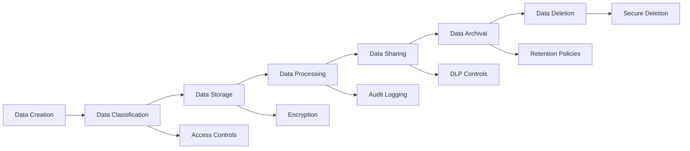

# Compliance and Governance Framework

This document outlines the compliance, governance, and regulatory considerations for the GenRF Circuit Diffuser project.

## Table of Contents

- [Overview](#overview)
- [Regulatory Compliance](#regulatory-compliance)
- [Data Governance](#data-governance)
- [AI/ML Governance](#aiml-governance)
- [Security Compliance](#security-compliance)
- [Export Control](#export-control)
- [Intellectual Property](#intellectual-property)
- [Quality Assurance](#quality-assurance)
- [Audit and Reporting](#audit-and-reporting)
- [Compliance Monitoring](#compliance-monitoring)

## Overview

GenRF Circuit Diffuser operates in the highly regulated electronic design automation (EDA) and semiconductor industry. This framework ensures compliance with applicable regulations while maintaining security, privacy, and quality standards.

### Regulatory Scope

- **Industry Standards**: IEEE, IEC, JEDEC standards for circuit design
- **Regional Regulations**: GDPR (EU), CCPA (California), SOX (US)
- **Export Control**: ITAR, EAR, dual-use technology regulations
- **AI/ML Regulations**: EU AI Act, algorithmic accountability frameworks
- **Quality Standards**: ISO 9001, ISO 27001, SOC 2 Type II

## Regulatory Compliance

### 1. Data Protection and Privacy

#### GDPR Compliance (EU)

**Legal Basis for Processing**:
- Legitimate interest for circuit design optimization
- Contractual necessity for service delivery
- Consent for research and analytics (where applicable)

**Data Subject Rights**:
- Right of access to personal data
- Right to rectification of inaccurate data
- Right to erasure ("right to be forgotten")
- Right to data portability
- Right to restrict processing
- Right to object to processing

**Implementation**:
```python
# Privacy compliance module
class PrivacyCompliance:
    def handle_data_subject_request(self, request_type: str, user_id: str):
        """Handle GDPR data subject requests."""
        if request_type == "access":
            return self.export_user_data(user_id)
        elif request_type == "deletion":
            return self.delete_user_data(user_id)
        elif request_type == "portability":
            return self.export_portable_data(user_id)
    
    def anonymize_circuit_data(self, circuit_data: dict) -> dict:
        """Remove personally identifiable information from circuit data."""
        # Implementation details
        pass
```

#### CCPA Compliance (California)

**Consumer Rights**:
- Right to know about personal information collection
- Right to delete personal information
- Right to opt-out of sale of personal information
- Right to non-discrimination for exercising privacy rights

### 2. Financial Compliance

#### SOX Compliance (Sarbanes-Oxley Act)

For public companies or contractors:

**Financial Reporting Controls**:
- Accurate financial reporting for R&D expenses
- Internal controls over financial reporting (ICFR)
- Executive certification of financial statements

**IT General Controls (ITGC)**:
- Access controls for financial systems
- Change management procedures
- Data backup and recovery processes
- Segregation of duties

### 3. Industry Standards Compliance

#### IEEE Standards
- **IEEE 1800**: SystemVerilog language standard
- **IEEE 1076**: VHDL language standard
- **IEEE 1364**: Verilog hardware description language

#### IEC Standards
- **IEC 61508**: Functional safety of electrical systems
- **IEC 62304**: Medical device software lifecycle processes

## Data Governance

### Data Classification

| Classification | Description | Examples | Controls |
|----------------|-------------|----------|----------|
| **Public** | Publicly available information | Published research, marketing materials | Standard access controls |
| **Internal** | Company proprietary information | Circuit designs, performance data | Employee access only |
| **Confidential** | Sensitive business information | Customer designs, pricing models | Need-to-know basis |
| **Restricted** | Highly sensitive information | Trade secrets, export-controlled data | Executive approval required |

### Data Lifecycle Management



### Data Retention Policies

| Data Type | Retention Period | Legal Basis | Disposal Method |
|-----------|------------------|-------------|-----------------|
| Circuit Designs | 7 years | SOX requirements | Secure deletion |
| User Personal Data | 2 years after last activity | GDPR Article 6 | Anonymization |
| Audit Logs | 7 years | Regulatory requirements | Encrypted archival |
| ML Training Data | 10 years | Research value | Secure storage |
| Financial Records | 7 years | Tax law requirements | Secure archival |

## AI/ML Governance

### EU AI Act Compliance

#### Risk Classification
GenRF Circuit Diffuser is classified as a **Limited Risk AI System** under the EU AI Act.

**Compliance Requirements**:
- Transparency obligations for users
- Clear disclosure of AI system capabilities and limitations
- Human oversight mechanisms
- Risk management system implementation

#### Implementation Framework

```python
class AIGovernance:
    def __init__(self):
        self.risk_level = "limited_risk"
        self.transparency_required = True
        self.human_oversight_required = True
    
    def generate_transparency_report(self) -> dict:
        """Generate transparency report for AI system."""
        return {
            "system_purpose": "Circuit design optimization",
            "data_sources": ["Public circuit databases", "Synthetic data"],
            "model_architecture": "Cycle-GAN + Diffusion Models",
            "limitations": [
                "Requires expert validation",
                "Limited to specific technology nodes",
                "Performance varies by circuit complexity"
            ],
            "human_oversight": "Required for all generated circuits",
            "accuracy_metrics": self.get_accuracy_metrics()
        }
    
    def enforce_human_oversight(self, circuit_design: dict) -> bool:
        """Ensure human oversight for generated circuits."""
        return self.require_expert_validation(circuit_design)
```

### Algorithmic Accountability

#### Bias Detection and Mitigation
- Regular bias audits of ML models
- Diverse training data validation
- Fairness metrics monitoring
- Bias mitigation techniques implementation

#### Model Interpretability
- SHAP (SHapley Additive exPlanations) values for model decisions
- LIME (Local Interpretable Model-agnostic Explanations) for local interpretability
- Attention visualization for transformer-based models
- Feature importance analysis

### AI Ethics Framework

#### Principles
1. **Transparency**: Clear communication about AI capabilities and limitations
2. **Accountability**: Human responsibility for AI decisions
3. **Fairness**: Unbiased treatment across different use cases
4. **Privacy**: Protection of sensitive design information
5. **Safety**: Validation of generated circuits before use
6. **Human Agency**: Maintaining human control over design decisions

## Security Compliance

### ISO 27001 Information Security Management

#### Information Security Policy
- Confidentiality, integrity, and availability of information
- Risk-based approach to information security
- Continuous improvement of security controls

#### Security Controls Implementation

| Control Category | Implementation | Monitoring |
|------------------|----------------|------------|
| Access Control | RBAC, MFA, privileged access management | Access logs, failed login attempts |
| Cryptography | AES-256 encryption, TLS 1.3, key management | Certificate expiry, key rotation |
| Physical Security | Data center security, device controls | Physical access logs, device inventory |
| Network Security | Firewalls, IDS/IPS, network segmentation | Network traffic analysis, threat detection |
| Application Security | Secure coding, vulnerability scanning | SAST/DAST results, penetration testing |

### SOC 2 Type II Compliance

#### Trust Service Criteria

**Security**:
- Logical and physical access controls
- System operations and availability
- Change management processes

**Availability**:
- System monitoring and performance management
- Incident response and disaster recovery
- Capacity management and scaling

**Processing Integrity**:
- Data validation and error handling
- System monitoring and alerting
- Quality assurance processes

**Confidentiality**:
- Data classification and handling
- Access controls and encryption
- Non-disclosure agreements

**Privacy**:
- Privacy notice and consent management
- Data collection and use limitations
- Individual rights and data subject requests

## Export Control

### ITAR (International Traffic in Arms Regulations)

**Assessment**: GenRF Circuit Diffuser's RF circuit generation capabilities may be subject to ITAR if used for defense applications.

**Compliance Measures**:
- Export control screening for all users
- Technology control plans for restricted technologies
- Registration with State Department (if required)
- Regular compliance training for staff

### EAR (Export Administration Regulations)

**ECCN Classification**: Likely 3E001.a for circuit design software

**Compliance Requirements**:
- Export license screening
- End-user verification
- Anti-boycott compliance
- Record keeping and reporting

**Implementation**:
```python
class ExportControl:
    def screen_user_request(self, user_info: dict, circuit_type: str) -> dict:
        """Screen user requests against export control lists."""
        screening_result = {
            "approved": True,
            "restrictions": [],
            "license_required": False
        }
        
        # Check denied persons list
        if self.check_denied_persons_list(user_info):
            screening_result["approved"] = False
            screening_result["restrictions"].append("Denied person")
        
        # Check end-use restrictions
        if self.check_restricted_end_use(circuit_type):
            screening_result["license_required"] = True
            screening_result["restrictions"].append("License required")
        
        return screening_result
```

## Intellectual Property

### Patent Protection

**Strategy**:
- File patents for novel AI algorithms and circuit generation techniques
- Monitor competitor patents for potential infringement
- Maintain defensive patent portfolio

**Implementation**:
- Regular invention disclosure reviews
- Patent landscape analysis
- Freedom to operate assessments

### Trade Secret Protection

**Measures**:
- Non-disclosure agreements for all personnel
- Limited access to proprietary algorithms
- Secure development environments
- Regular trade secret audits

### Open Source Compliance

**License Compliance**:
- Automated license scanning in CI/CD pipeline
- Legal review of all dependencies
- Compliance with copyleft licenses
- Contribution agreements for open source projects

```python
# License compliance check
def check_license_compliance():
    """Check all dependencies for license compliance."""
    allowed_licenses = [
        "MIT", "Apache-2.0", "BSD-3-Clause", "BSD-2-Clause"
    ]
    
    problematic_licenses = [
        "GPL-3.0", "AGPL-3.0", "SSPL-1.0"
    ]
    
    # Implementation details
    pass
```

## Quality Assurance

### ISO 9001 Quality Management System

#### Quality Policy
- Customer focus and satisfaction
- Continuous improvement of processes
- Evidence-based decision making
- Leadership and engagement of people

#### Quality Objectives
- Circuit generation accuracy > 95%
- Customer satisfaction score > 4.5/5
- Defect rate < 0.1%
- On-time delivery > 99%

### Validation and Verification

#### Circuit Validation Process
1. **Specification Review**: Validate input requirements
2. **Generation Validation**: Verify circuit topology and parameters
3. **SPICE Simulation**: Validate electrical performance
4. **Design Rule Check**: Ensure manufacturability
5. **Expert Review**: Human validation of complex designs

#### Software Validation
- Unit testing with >90% code coverage
- Integration testing of all system components
- Performance testing under load conditions
- Security testing including penetration testing
- User acceptance testing with domain experts

## Audit and Reporting

### Internal Audits

#### Audit Schedule
- **Quarterly**: Security controls and access management
- **Semi-annually**: Data governance and privacy compliance
- **Annually**: Quality management system and export control

#### Audit Scope
- Compliance with policies and procedures
- Effectiveness of controls
- Risk management processes
- Incident response capabilities

### External Audits

#### SOC 2 Type II Audit
- Annual audit by certified public accounting firm
- Testing of controls over 12-month period
- Report for customers and stakeholders

#### ISO Certification Audits
- Annual surveillance audits
- Three-year recertification audits
- Corrective action implementation

### Regulatory Reporting

#### Privacy Breach Notification
- **GDPR**: 72-hour notification to supervisory authority
- **CCPA**: Notification to California Attorney General
- **State Laws**: Notification per applicable state requirements

#### Export Control Reporting
- Annual export administration report
- Voluntary self-disclosure for violations
- License application submissions

## Compliance Monitoring

### Automated Monitoring

```python
class ComplianceMonitoring:
    def __init__(self):
        self.monitors = {
            "data_retention": DataRetentionMonitor(),
            "access_control": AccessControlMonitor(),
            "export_control": ExportControlMonitor(),
            "privacy": PrivacyComplianceMonitor()
        }
    
    def run_compliance_checks(self) -> dict:
        """Run all compliance monitoring checks."""
        results = {}
        for monitor_name, monitor in self.monitors.items():
            results[monitor_name] = monitor.check_compliance()
        return results
    
    def generate_compliance_dashboard(self) -> dict:
        """Generate compliance dashboard metrics."""
        return {
            "compliance_score": self.calculate_compliance_score(),
            "open_issues": self.get_open_compliance_issues(),
            "recent_audits": self.get_recent_audit_results(),
            "upcoming_deadlines": self.get_compliance_deadlines()
        }
```

### Key Performance Indicators (KPIs)

| KPI | Target | Frequency | Owner |
|-----|--------|-----------|-------|
| Compliance Score | >95% | Monthly | Compliance Officer |
| Security Incidents | <5 per quarter | Monthly | CISO |
| Privacy Requests Response Time | <30 days | Weekly | DPO |
| Audit Findings | <10 per audit | Per audit | Quality Manager |
| Training Completion | >95% | Quarterly | HR/Compliance |

### Compliance Training

#### Training Requirements
- **All Personnel**: General compliance awareness (annual)
- **Developers**: Secure coding and privacy by design (semi-annual)
- **Data Handlers**: Data protection and privacy (annual)
- **Export Personnel**: Export control regulations (annual)
- **Leadership**: Governance and risk management (annual)

#### Training Tracking
- Learning management system (LMS) integration
- Automated compliance training assignments
- Progress tracking and reporting
- Certification renewal notifications

## Incident Response

### Compliance Incident Management

#### Incident Types
1. **Data Breach**: Unauthorized access to personal or confidential data
2. **Export Violation**: Unauthorized technology transfer or access
3. **AI Bias**: Discriminatory or unfair AI system behavior
4. **Quality Issue**: Circuit generation failure or inaccuracy
5. **Privacy Violation**: Improper handling of personal data

#### Response Process
1. **Detection**: Automated monitoring or manual reporting
2. **Assessment**: Impact and severity evaluation
3. **Containment**: Immediate action to limit impact
4. **Investigation**: Root cause analysis and documentation
5. **Notification**: Regulatory and stakeholder communication
6. **Remediation**: Corrective and preventive actions
7. **Review**: Lessons learned and process improvement

### Business Continuity

#### Continuity Planning
- Risk assessment and business impact analysis
- Continuity strategies and procedures
- Recovery time and point objectives
- Regular testing and maintenance

#### Disaster Recovery
- Data backup and recovery procedures
- Alternative processing sites
- Communication plans and procedures
- Regular testing and validation

This compliance framework provides comprehensive coverage of regulatory requirements while maintaining flexibility for future changes in the regulatory landscape.